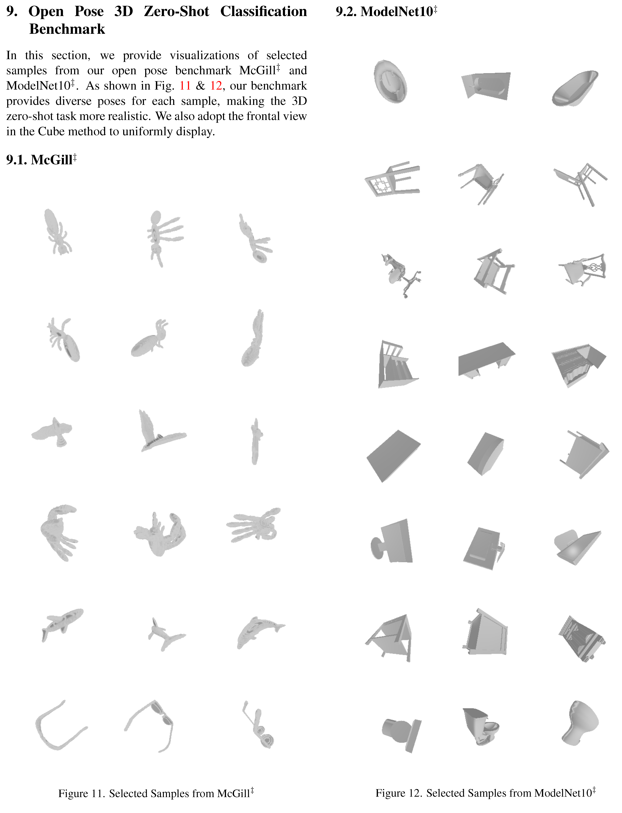
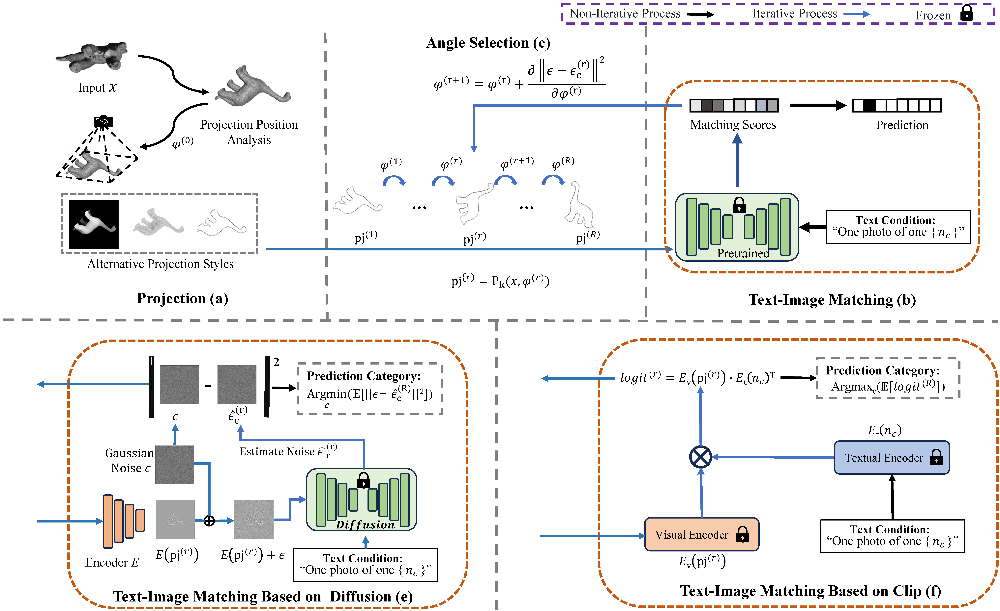

# Open-Pose 3D Zero-Shot Learning: Benchmark and Challenges

- [x] Release environment setting
- [ ] Release datasets ModelNet40<sup>‡</sup>, ModelNet10<sup>‡</sup>, McGill<sup>‡</sup> 
- [ ] Release our baseline eval code (Clip-Based & Diffusion-Based)

## Open-Pose Benchmark 
| Datasets | Total Classes | Seen/Unseen Classes | Train/Valid/Test Samples| Download |
|:---:|:---:|:---:|:---:|:---:|
|ModelNet40<sup>‡</sup>| 40| 30/-| 5852/1560/-| |
|ModelNet10<sup>‡</sup>| 10| -/10| -/-/908| |
|McGill<sup>‡</sup>| 19| -/14| -/-/115| |




## Our Baseline Method


### Environment
Our baseline (Diffusion-based or Clip-based) could be conducted on one single RTX3090 or RTX4090. 
```    
conda env create -f op3dzsl.yaml
conda activtae op3dzsl
pip install git+https://github.com/openai/CLIP.git
```

Download the Diffusion pretrain model [our google driver]() or [official website](https://huggingface.co/runwayml/stable-diffusion-v1-5). Rename the pretrained model as "model.ckpt" and put it in the directory "models/ldm/stable-diffusion-v1/".


### Baseline Evaluation

For our Clip-Based baseline

```    
python baseline_eval/clip_eval.py
```

For our Diffusion-Based baseline

```    
python baseline_eval/diffusion_eval.py
```

## Citation
If you find this work useful in your research, please cite:
```
@article{zhao2023diff,
  title={Open-Pose 3D Zero-Shot Learning: Benchmark and Challenges},
  author={Zhao, Weiguang and Yang, Guanyu and Zhang, Rui and Jiang, Chenru and Yang, Chaolong and Yan, Yuyao and Hussain, Amir and Huang, Kaizhu},
  journal={arXiv preprint arXiv:2312.07039},
  year={2023}
}
```

Our open-pose datasets developed from the previous work: ModelNet40 and McGill. If you use our open-pose datasets, you also need to cite these two work:

```
@inproceedings{ModelNet,
  title={3d shapenets: A deep representation for volumetric shapes},
  author={Wu, Zhirong and Song, Shuran and Khosla, Aditya and Yu, Fisher and Zhang, Linguang and Tang, Xiaoou and Xiao, Jianxiong},
  booktitle={Proceedings of the IEEE conference on computer vision and pattern recognition},
  pages={1912--1920},
  year={2015}
}
```

```
@article{McGill,
  title={Retrieving articulated 3-D models using medial surfaces},
  author={Siddiqi, Kaleem and Zhang, Juan and Macrini, Diego and Shokoufandeh, Ali and Bouix, Sylvain and Dickinson, Sven},
  journal={Machine Vision and Application},
  volume={19},
  pages={261--275},
  year={2008}
}
```